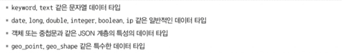
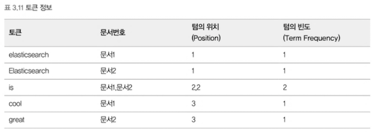
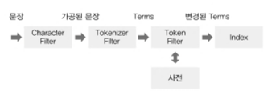

# 데이터 모델링
- 데이터 모델링 왜필요할까 ?
  - 엘라스틱 서치는 사전에 매핑을 하지않으면 자동으로 데이터를 매핑하기때문에 운영환경에서 성능, 저장효율을 낮출수있다

- ## 매핑 API 이해하기
    - 매핑이란 색인 시 데이터가 어디에 어떻게 저장될지를 결정하는 설정을 말한다
      - RDB의 스키마에 대응한다
    - 주의 할점으로는 데이터 타입을 한번 지정할경우 수정할 수 없고 재색인 (reindexing) 과정을 거쳐야한다
    - 자동 매핑의 단점
      - ex) 첫번쨰 데이터가 숫자로 들어온경우 스키마는 숫자만 들어오는 필드로 생각해서 숫자관련 필드정보로 생성하여 다음 데이터 부터는 문자열이 들어오면 색인에 실패하게됌
    - 매핑전에 고민해봐야 할점
      - 문자열을 분석할것인가?
      - _source에 어떤 필드를 정의할것인가?
      - 날짜 필드를 가지는 필드는 무엇인가?
      - 매핑에 정의 되지않고 유입되는 필드는 어떻게 처리할것인가 ?
    - ### 매핑확인하기
      - GET /{index명}/_mapping
    - ### 매핑 파라미터
      - analyzer
        - 형태소를 분석하겠다는 의미의 파라미터
        - 분석기를 지정한다
      - normalizer
        - term query에 분석기를 사용하기 위해서 사용된다 (원래 term query는 원문만 검색가능하다)
      - boost
        - 필드의 가중치를 지정한다
        - 가중치에 따라서 유사도 점수가 달라지기때문에 boost 설정시 검색 결과의 노출 순서에 영향을준다
      - coerce
        - 색인 시 자동 변환을 허용할지의 여부를 설정하는 파라미터
        - ex) 10 이라는 값이 문자열로 들어왔을때 Integer 타입의 필드라면 "10"(문자열) => 10(숫자) 로 자동 형변환처리
      - copy_to
        - 필드의 값을 복사하여 새로운 필드를 생성한다
        - ex) 필드의 값을 복사하여 검색시 사용할 필드를 생성한다 => 검색속도 증가에 사용될수있음 하나의 필드만 검색하기 때문에 대신 용량이 더나갈수있음
      - doc_values
        - 엘라스틱서치에서 사용하는 기본 캐시로 text 타입을 제외한 모든타입에서 기본적으로 doc_values이 캐시를 이용한다.
      - dynamic
        - 필드의 동적 추가를 허용할지 결정한다
      - enabled
        - 검색결과에는 포함하지만 색인은 하고싶지 않은경우 사용
      - fielddata
        - 엘라스틱서치가 힙공간에 생성하는 메모리 캐시 메모리 부족현상으로 요즘은 잘사용되지않고 doc_values캐시를 사용
      - fields
        - 다중 필드를 설정한다
        - ex) text 필드에 keyword 필드를 추가하여 분석과 집계를 동시에 사용할 수 있다
      - format
        - 날짜 필드의 포맷을 지정한다
      - ignore_above
        - 문자열의 길이가 지정한 값보다 크면 빈값으로 색인한다
      - ignore_malformed
        - 엘라스틱서치는 데이터 타입이 맞지 않는 필드는 색인하지 않는다 이때 이 파라미터를 사용하면 해당 필드만 무시하고 색인이 가능하다.
      - index
        - 필드의 색인 여부를 결정한다
      - norms
        - 필드의 정규화 여부를 결정한다
        - 단순 필더링 필드는 비활성화 해서 디스크공간을 절약할수있다
      - null_value
        - 필드의 값이 null일때 지정한 값을 색인한다
      - position_increment_gap
        - 포지션 갭을 지정한다
        - ex) 데이터가 [John Arthur, Lincon Smith] 일때 Arthur Lincon 이라고 검색해도 검색이 가능하다
      - properties
        - 오브젝트 타입이나 중첩 타입의 스키마를 정의 할때 사용되는 옵션이다
      - search_analyzer
        - 일반적으로는 검색과 색인시 같은 분석기를 사용하지만 이옵션을 사용하면 검색시 사용할 분석기를 따로 저장할수있다
      - similarity
        - 필드의 유사도 알고리즘을 지정한다
      - store
        - 필드의 값을 따로 저장할지 결정한다
      - term_vector
        - 루씬에서 분석된 용어의 정보를 포함할지 여부를 결정한다
- ## 메타 필드
  - **메타 필드는 엘라스틱 서치에서 생성한 문서에서 제공하는 특별한 필드다. (특수목적)**
    - _index
      - 문서가 속한 인덱스의 이름을 나타낸다
    - _type
      - 문서가 속한 매핑의 타입 정보를 담고있다
    - _id
      - 문서의 고유 식별자를 나타낸다
    - _source
      - 실제 문서의 정보를 담고있는 필드다
    - _uid
      - 문서의 고유 식별자를 나타낸다
    - _all
      - 모든 필드의 값을 하나의 필드로 만들어 검색할 수 있게 해준다
      - 하지만 데이터의 크기를 너무많이 차지해서 6.0 이상부터는 deprecated 되었다
    - _routing
      - 문서가 속한 샤드를 결정하는 데 사용된다
- ## 필드 데이터타입
  
  - text
    - 색인 시 지정된 분석기가 컬럼의 데이터를 문자열 데이터로 인식하고 이를 분석함
    - 정렬이나 집계(Aggregation)에서 사용할수없음
    - 정렬이나 집계 연산을 사용해야할 때, Text 타입과 Keyword 타입을 동시에 갖도록 멀티 필드로 설정하여 이용할 수 있음
    - 문장 형태의 데이터에 적합하고 이를 전문검색할수있음
  - keywrod
    - 키워드 형태로 사용할 데이터에 적합한 데이터 타입
    - 별도의 분석기를 거치지 않고 원문 그대로 색인
    - 정형화된 콘텐츠에 주로 사용됨 
    - 집계(Aggregation), 정렬, 검색 시 필터링되는 항목에 주로 사용됨
  - Array
  - Numeric
  - Date
  - Range
  - Boolean
  - Geo-Point
  - IP
  - Object
  - Nested

- ## 엘라스틱서치 분석기
  - ### 텍스트 분석 개요
    - 기본적으로 지정하지 않을 경우 standard Analyzer가 사용된다 (한글의 경우 띄워쓰기로 분리됨)
  - ### 역색인구조
    - 모든 문서가 가지는 단어의 고유 단어 목록
    - 해당 단어가 어떤 문서에 속해 있는지에 대한 정보
    - 전체 문서에 각 단어가 몇 개 들어있는지에 대한 정보
    - 하나의 문서에 단어가 몇 번씩 출연했는지에 대한 빈도

       

  - ### 분석기의 구조
    - 분석기의 프로세스
      - 문장을 특정한 규칙에 의해 수정한다
      - 수정한 문장을 개별 토큰으로 분리한다
      - 개별 토큰을 특정한 규칙에 의해 변경한다

    - 구조

       

      - Character Filter
        - 문장을 분석하기 전에 입력 텍스트에 대해 특정한 단어를 변경하거나 Html과 같은 태그를 제거하는 역할을 하는 필터
      - Tokenizer Filter
        - 분석기를 구성할때 하나만 사용할 수 있으면 텍스트를 어떻게 나눌 것인지를 정의하는 필터
      - Token Filter
        - 토큰화된 단어를 하나씩 필터링 해서 사용자가 원하는 토큰으로 변환하는 필터
        - ex) 동의어,불용어,대소문자 적용

- ## Document API 이해하기
  - 종류
    - index api : 문서생성
    - get api : 문서조회
    - delete api : 문서 삭제
    - update api : 문서 수정
    - bulk api : 대량 문서 처리
    - reindex api : 문서 복사
  - 문서 파라미터
    - 문서 ID 자동생성
      - 기본적으로 문서를 ID로 구분하기 때문에 반드시 필요하다 하지만 ID를 부여하지 않고 문서 생성시에 ES에서 자동으로 ID를 부여하고 이는 UUID 형태의 값이다
    - 버전 관리
      - 색인된 모든 문서는 버전 값을 가지고 있다
        - update api 경우 내부적으로 스냅숏을 생성해서 문서를 수정하고 인덱스를 다시 재색인 하는 과정을 거치는데 이때 스냅숏이 생성된 사이에 버전값이 달라지면 실패처리를 한다
      - 오퍼레이션 타입  (op_type)
        - 일반적으로 ID가 존재하면 Update 없는경우는 Create 작업이 일어난다 이때 데이터가 존재할경우 update 하지 않고 실패하게 할 경우 이 파라미터를 사용하면 된다
      - 인덱스 매핑 정보 자동 생성
        - 이 옵션을 이용하면 필드의 정보,인덱스가 존재하지 않을 경우 동적으로 생성할지 대한 파라미터이다 기본값은 모두 true이다
