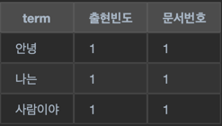
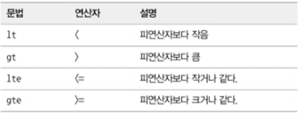
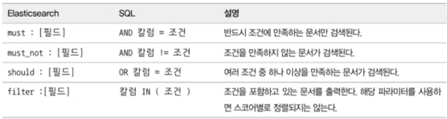

# 데이터 검색
- 검색대상은 크게 2가지로 나뉜다.
  - 분석이 되는 Text
  - 분석이 되지 않는 Keyword

## 검색 API
- 검색은 텀이라는 것이 일치하는것을 가져오는 것 이라고 생각하면된다.
- 텀이라는것은 문장을 분해 한것을 말한다.
  - ex) 안녕 나는 사람이야 => 기본 분석기 => ['안녕','나는','사람이야'] 라는 텀으로 나누어진다
  - 이 텀을 역색인 구조를 만들어 내부적으로 저장한다.
  - 
###  검색 질의 표현 방식
- URL 검색
  - HTTP GET 요청을 활용한 쿼리 스트링 검색 방식 Key=Value 형태로 검색 질의를 표현한다.
  - 복잡한 질의는 하기 어렵다.
  - 빠르게 테스트 할 수 있다.
- Request Body 검색
  - HTTP 요청시 Body에 검색 질의를 JSON 형태로 표현한다. (Query DSL 이라는 문접을 지원)
  - 엘라스틱 서치가 제공하는 검색 api를 모두 활용하기 위해서는 Request Body 검색을 사용해야 한다.
  - 가독성이 전체적으로 좋아진다.

### Query DSL 이해하기
- Query DSL 쿼리의 구조
  - size : 검색결과의 크기를 지정한다. 기본값은 10이다.
  - from : 몇번 문서부터 가져올지 결정한다. 기본값은 0이다.
  - timeout : 검색 요청에 대한 타임아웃을 지정한다. 너무짧게 잡으면 결과의 일부만 나올 수 있다. 기본값은 무한대이다.
  - _source : 검색 결과에서 출력하고 싶은 필드를 지정한다.
  - query : 검색 조건문이 들어가는 곳 이다.
  - sort : 문서 결과를 어떻게 출력할지에 대해 지정하는곳.
  - aggs : 통계 및 집계를 사용할 때 사용하는 곳.
  - 예시 :
    ```json
    {
      "size": 0,
      "from": 0,
      "timeout": "0",
      "_source": {
        "includes": [ 
          "title",
          "price"
        ],
        "excludes": []
      },
      "query": {
        "match_all": {}
      },
      "sort": [
        {
          "price": {
            "order": "desc"
          }
        }
      ],
      "aggs": {}
    }
    ```

- 응답
    - "took": 2, // 응답 시간
    - "timed_out": false, // 타임아웃 여부
    - "_shards": {
      - "total": 1, // 샤드의 갯수
      - "successful": 1, // 성공한 샤드의 갯수
      - "skipped": 0, // 스킵된 샤드의 갯수
      - "failed": 0 // 실패한 샤드의 갯수
    },
    - "hits": {
      - "total": 3, // 검색된 문서의 총 갯수
      - "max_score": null, // 검색된 문서중 가장 높은 스코어
      - "hits": [] // 검색된 문서들
    }
- Query DSL 쿼리와 필터
  - 성능이나 과정이 크게 달라지기 때문에 필요한 용도에 따라서 사용해야 한다.

  |       | 쿼리 컨텍스트                                              | 필터 컨텍스트               |
  |:------|:--------------------------------------------------------|:-----------------------|
  | 용도   | 전문 검색시 사용                                            | 조건 검색 시 사용 (yes/no) |
  | 특징   | 분석기에 의해서 수행됨  <br> 연관성 score를 계산 <br> 질의가 요청될 때마다 엘라스틱서치에서 내부의 루씬을 이용해 계산을 수행 (이때 결과가 캐싱 되지 않는다)<br> 일반적으로 전문 검색에 많이 사용 <br> 캐싱되지 않고 디스크 연산을 수행하기 때문에 상대적으로 느리다|  yes/no로 단순 판별 가능 <br> 연관성 관련 계산 하지 않음 <br> 기본적으로 메모리 연산을 수행하기 때문에 상대적으로 빠름 <br> 자주 사용되는 필터의 결과는 엘라스틱서치가 내부적으로 캐싱함                     |
  | 사용 예 | "중고 선풍기 싸게 팔아요~" 같은 문장 분석 (title,content ...)                                                    | "product_status" 라는 필드가 high 인지 middle인지 필터링할 때               |


- Query DSL 주요 파라미터
  - **Multi Index 검색**
    - 기본적으로 Multi Index, Multi Type 검색이 가능하다.
      - GET book,article/_search => book,article 인덱스에서 검색을 수행한다.
    - 인덱스 검색 와일드 카드 검색 가능
      - log-2023-03-* => log-2023-03-01, log-2023-03-02, log-2023-03-03 ... 인덱스에서 검색을 수행한다.
    - 위 기능을 통해서 대량 데이터를 효율 적으로 집계 통계 가능하고 비정형 데이터를 한번에 검색가능함
  - **쿼리 결과 페이징(from, size)**
    - ES는 관계형 데이터 베이스와 다르게 페이징된 해당 문서만 선택적으로 가져오는 것이 아니라 모든 문서를 가져온 후에 페이징을 수행한다. (no-offset 기준)
      - "from" : 5, size : 5 => 5번째 문서부터 5개의 문서를 가져온다.(2페이지) => 이를 위해 10건의 문서를 읽어야한다.
    - 페이지 번호가 높아질수록 (from) 쿼리의 비용은 높아진다.
      - search_after,scroll api를 사용해서 해결 가능하다.
  - **쿼리 결과 정렬(sort)**
    - 기본적으로 계산되는 유사도에 대한 스코어 값으로 정렬 하는 것이 아닌 필드 이름, 가격, 날짜 등으로 재정렬 하고 싶은 경우 사용한다.
  - **쿼리 결과 필터링(_source)**
    - 기본적으로 모든 필드를 가져오지만 필요한 필드만 가져오고 싶은 경우 사용한다.
      - 필요한 필드만 조회하면 데이터의 크기를 작아지기 때문에 네트워크의 사용량을 줄일 수 있는 장점이 있다.
  - **범위 검색**
    - 
    - ```json
        {
          "query": {
            "range": {
              "price": {
                "gte": 10000, // 10000 이상
                "lte": 50000 // 50000 이하
              }
            }
          }
        }
        ```
  - **operator**
    - match 쿼리는 기본적으로 OR 연산을 수행한다.
      - or 연산수행시 minimum_should_match 파라미터를 사용해서 텀의 개수가 몇 개 이상 매칭될대만 결과로 나오게해 and 연산과 비슷한 효과를 낼 수 있다.
        - ```json
              {
                "query": {
                  "match": {
                    "title": {
                      "query": "중고 선풍기", 
                      "minimum_should_match": 2
                    }
                  }
                }
              }
              ```  
    - AND 연산을 수행하고 싶은 경우 operator 파라미터를 사용한다.
    - ```json
        {
          "query": {
            "match": {
              "title": {
                "query": "중고 선풍기", 
                "operator": "and"
              }
            }
          }
        }
        ```
  - **fuzziness**
    - 오타가 있는 문서를  검색하고 싶은 경우 사용한다.
    - 오차범위 0,1,2,AUTO
    - ```json
        {
          "query": {
            "match": {
              "title": {
                "query": "fli high", //fly high 검색가능
                "fuzziness": 1
              }
            }
          }
        }
        ```
  - **boost**
    - 특정 필드에 가중치를 두고 싶은 경우 사용한다.
    - ```json
        {
          "query": {
            "match": {
              "title": {
                "query": "중고 선풍기", 
                "fields" : ["product_name^10", "title^5"] // product_name 필드에 가중치 10, title 필드에 가중치 5
              }
            }
          }
        }
        ```

- Query DSL 주요 쿼리
  - **Match All Query**
    - 모든 문서를 검색한다.
    - ```json
        {
          "query": {
            "match_all": {}
          }
        }
        ```

  - **Match Query**
    - 형태소 분석을 통해 텀으로 분리된 후 이 텀들을 이용해 검색을 수행한다. 따라서 검색어가 분석돼야 할 경우에 사용한다.
    - ```json
        {
          "query": {
            "match": {
              "product_name": "중고 선풍기" // 형태소 분석을 통해 "중고", "선풍기" 로 분석된 후 검색을 수행한다. operator 파라미터를 사용하지 않았기 때문에 OR 연산을 수행한다.
            }
          }
        }
        ```
  - **Multi Match Query**
    - 단일 필드가 아닌 여러 필드를 대상으로 검색을 수행한다.
    - ```json
        {
          "query": {
            "multi_match": {
              "query": "중고 선풍기", 
              "fields": ["product_name", "title"] // product_name, title 필드를 대상으로 검색을 수행한다.
            }
          }
        }
        ```
  - **Term Query**
    - 텀을 분석하지 않고 검색을 수행한다. keyword 데이터 타입을 대상으로 검색을 수행한다.
    - 키워드가 정확하지 않으면 검색이 되지 않는다.
    - ```json
        {
          "query": {
            "term": {
              "product_name": "중고 선풍기" // "중고 선풍기" 라는 키워드를 가진 문서를 검색한다. 
            }
          }
        }
        ```
  - **Bool Query**
    - 하나의 쿼리나 여러 개의 쿼리를 조합해서 더 높은 스코어를 가진 쿼리 조건으로 검색하는 방법이다.
    - RDB에서 AND, OR로 묶은 여러조건을 where절에 사용하는 것과 유사하다.
    - ```json
      {
        "query": {
          "bool": {
            "must": [
              {
                "match": {
                  "product_name": "중고 선풍기"
                }
              },
              {
                "match": {
                  "title": "중고 선풍기"
                }
              }
            ]
          }
        }
      }
      ```
    - 
  - **Prefix Query**
    - 특정 필드의 값이 특정 접두사로 시작하는 문서를 검색한다.
    - ```json
        {
          "query": {
            "prefix": {
              "product_name": "중고" // product_name 필드의 값이 "중고" 로 시작하는 문서를 검색한다.
            }
          }
        }
        ```
  - **Exists Query**
    - 특정 필드가 존재하는 문서를 검색한다. 즉 null 인 문서는 나오지 않는다.
    - null이거나 필드가 없는 문서를 찾고싶다면 must_not을 사용한다.
    - ```json
        {
          "query": {
            "exists": {
              "field": "product_name" // product_name 필드가 존재하는 문서를 검색한다.
            }
          }
        }
        ```
  - **Wildcard Query**
    - 와일드카드를 이용해 검색한다.
      - "*" : 문자의 길이와 상관없이 와일드카드와 일치하는 문서를 찾는다.
      - "?" : 지정된 위치의 한 글자가 다른 경우의 문서를 찾는다.

    - ```json
        {
          "query": {
            "wildcard": {
              "product_name": "중고*" // product_name 필드의 값이 "중고" 로 시작하는 문서를 검색한다.
            }
          }
        }
        ```
  - **Nested Query**
    - 중첩된 객체를 검색한다.
    - RDB의 JOIN과 유사하다.
    - 엘라스틱 서치는 성능상의 이유로 Parent 문서와 Child 문서를 모두 같은 샤드에 저장한다.
    - 따라서 특정 Parent 문서에 포함된 Child의 문서가 비정상적으로 커질 경우 샤드의 크기가 일정하게 분배 되지 못하는 문제점이 발생하게 된다. (스키마 설계시 고려)

### 부가적인 검색 API
- **효율 적인 검색을 위한 환경설정**
  - 엘라스틱 서치는 모든 샤드에 검색 요청을 브로드캐스팅 해서 전달하고 기다린다.
    - 여기서 타임아웃을 설정해 모든 샤드의 응답을 받지 않고 일부 샤드의 응답만 받아도 검색을 수행할 수 있는 것 같음
  - 따라서 각자의 데이터 특성이나 검색 패턴에 따라 이러한 환경설정을 통해 검색 성능을 향상시킬 수 있다.
- **동적 분배 방식의 샤드 선택**
  - 원본 샤드와 레플리카 샤드를 함게 운영 하지만 모든 샤드에서 검색을 수행한다면 중복된 검색 결과를 전달 할 수 있기 때문에 엘라스틱서치는 동일 데이터를 가지고 있는 샤드 중 하나만 선택해 검색을 수행한다
    - 레플리카 or 원본샤드 중 하나만 선택해 검색을 수행함
  - 적절한 분배를 위해 라운드 로빈을 사용하지만 동적 분배 방식이라는 것이 존재 한다.
    - 동적 분배 방식을 사용하면 샤드의 부하를 고려해 샤드를 선택한다. (응답시간, 스레드 풀의 크기 등 고려)
- **글로벌 타임아웃 설정**
  - 검색 요청에 대한 응답을 기다리는 시간을 설정한다. 무거운 쿼리가 타임 아웃 설정 없이 무한정 실행된다면 시스템 장애가 발생할 수 있다.
  - Reqeust Body에 설정할 수 도 있지만 모든 검색 쿼리에 동일하게 적용 되도록 설정하는 것이 안전하다.
- **Search Shards API**
  - 검색 요청이 어떤 샤드에서 수행되는지 노드 및 샤드에 대한 정보를 확인할 수 있다.
  - `POST product/_search_shards`
- **Multi Search API**
  - 여러 개의 검색 요청을 한 번에 수행할 수 있다.
  - 여러 인덱스를 사용해서 사용자별 맞춤 페이지 등을 구현할때 유용하다.
  - POST _msearch
    ```json
    {"index": "product"}
    {"query": {"match": {"product_name": "중고 선풍기"}}}
    {"index": "user"}
    {"query": {"match": {"name": "김"}}}
    ```

- **Count API**
  - 검색 결과의 개수를 반환한다.
  - 문서의 내용이 아니라 개수만 필요할 때 사용
- **Validate API**
  - 검색 쿼리가 유효한지 확인한다.( 문법 오류 검증 )
- **Explain API**
  - 검색 결과의 점수를 계산하는데 사용되는 세부 정보를 확인할 수 있다.
  - 특정 문서가 잘 검색되지 않는다면 이 API를 통해 문제를 파악할 수 있다.
- **Profile API (RDB : EXPLAIN ANALYZE)**
  - 쿼리에 대한 상세 수행 계획과 각 단계별 수행 시간을 확인할 수 있어 쿼리의 성능을 튜닝할 때 유용하다.
  - 단점으로는 내용이 매우 상세해 결과가 매우 방대하다는 점이다. 특히 여러 샤드에 걸쳐 검색되는 쿼리의 경우 더 길어지기 때문에 더 확인하기 힘들다.
  - 실제 쿼리가 수행된 샤드별 프로파일 정보를 제공하고 실행된 쿼리의 종류와 샤드마다 몇 건의 문서가 매칭 됬는지, 검색에 수행된 시간은 어떤지 자세한 정보를 알려준다.
- **Explain API vs Profile API**
    - Explain API => 스코어가 어떻게 계산됬는가 ?
    - Profile API => 쿼리가 수행되는 시간에 샤드별로 얼마나 많은 시간이 소요됐는가 ?
