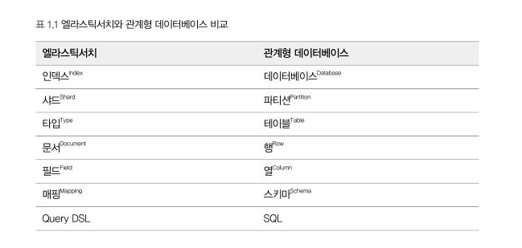
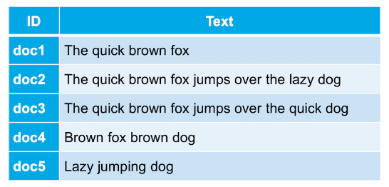
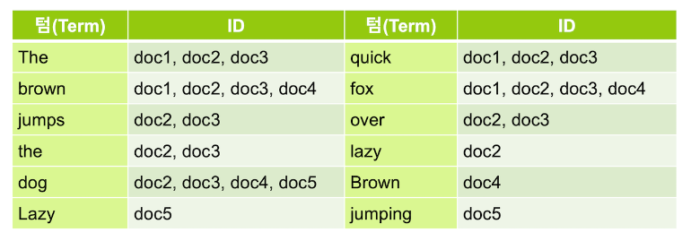

# 검색 시스템 이해하기

- ## 검색 시스템의 이해
  -  ### 검색 시스템이란
     -  대용량 데이터를 기반으로 신뢰성 있는 검색 결과를 제공하기위해 검색 엔진을 기반으로 구축된 시스템을 통칭하는 용어임
     - 검색 서비스 > 검색 시스템 > 검색엔진
       - elasticsearch는 검색엔진
  - ### 검색 시스템의 구성요소
    - 수집기 : 크롤러, 웜, 스파이더 등.. 데이터를 수집하는 프로그램
    - 스토리지 : 색인 데이터를 보관하는 물리적인 저장소
    - 색인기 : 검색이 가능한 구조로 가공하고 저장하는 프로그램 (형태소 분석기를 이용해서 의미있는 용어를 추출하고 검색에 유리한 역색인 구조로 데이터를 저장)
    - 검색기 : 색인기에서 저장한 역색인 구조의 데이터를 검색하는 프로그램 (색인기와 마찬가지로 형태소 분석기를 이용해 사용자 질의에 유의미한 용어를 추출해 검색)
  - ### 관계형 데이터베이스와의 차이점
    
  - ### 구조적 차이
    - #### 관계형 데이터베이스

    
    - #### elasticsearch
    
    
  - 출처 : https://esbook.kimjmin.net/06-text-analysis/6.1-indexing-data
  - ### elasticsearch가 강력한 이유 (다른 NOSQl의 차이점도 몇 가지 있음 ex : 역인덱스 구조)
    - 통계분석 : kibana를 통해 시각화 가능
    - 멀티테넌시 : 여러개의 인덱스를 한번에 조회가능
    - 스키마리스 : 데이터를 저장할 때 스키마를 정의하지 않아도 됨
    - RESTful API : HTTP기반의 RESTful API를 통해 데이터를 색인하고 검색할 수 있음
    - Document-Oriented : JSON 형태로 데이터를 저장하고 검색가능
    - 역색인 : 검색에 유리한 구조로 데이터를 저장( 다른 NOSQL과 차별점)
    - 확장성과 가용성 : 클러스터링,샤딩을 통해 데이터를 분산 저장하고 검색할 수 있음
    - 오픈소스 : 빠른 버그 수정과 많은 문서
    - 전문검색 : 검색엔진의 핵심기능인 고차원의 전문검색을 지원
  - ### elasticsearch의 약점
    - 실시간이 아니다 : 데이터가 색인되고 검색될 때까지 약간의 시간이 소요됨
    - 트랜잭션, 롤백 미지원 : 데이터를 색인하고 검색하는 과정에서 트랜잭션을 지원하지 않음 최악의 경우 데이터 손실의 위험이 존재함
    - 데이터의 불변성 : 데이터의 업데이트를 제공 하지않고 기존 문서를 삭제하고 새로운 문서를 생성 => 하지만 그리 큰단점은 아님